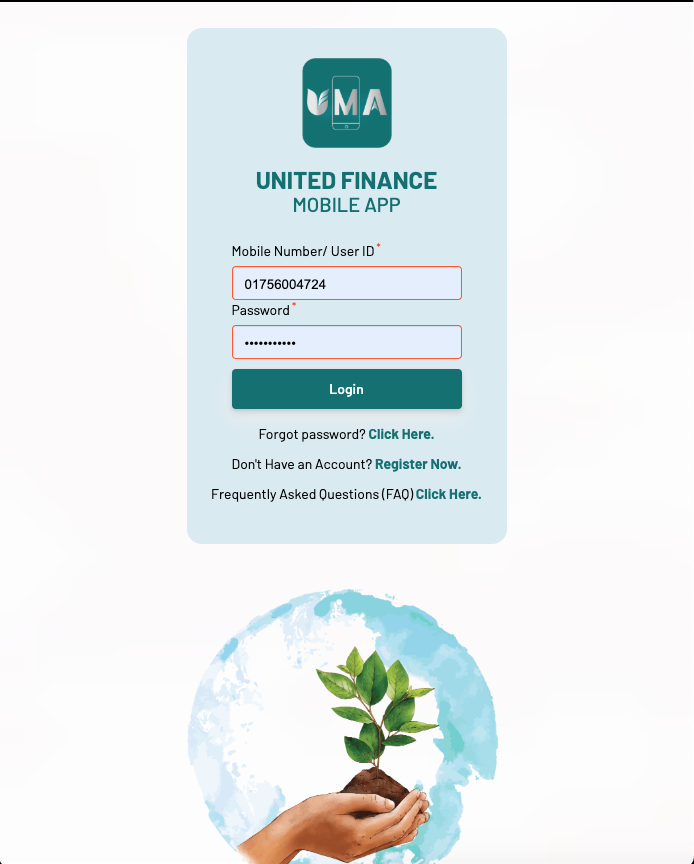
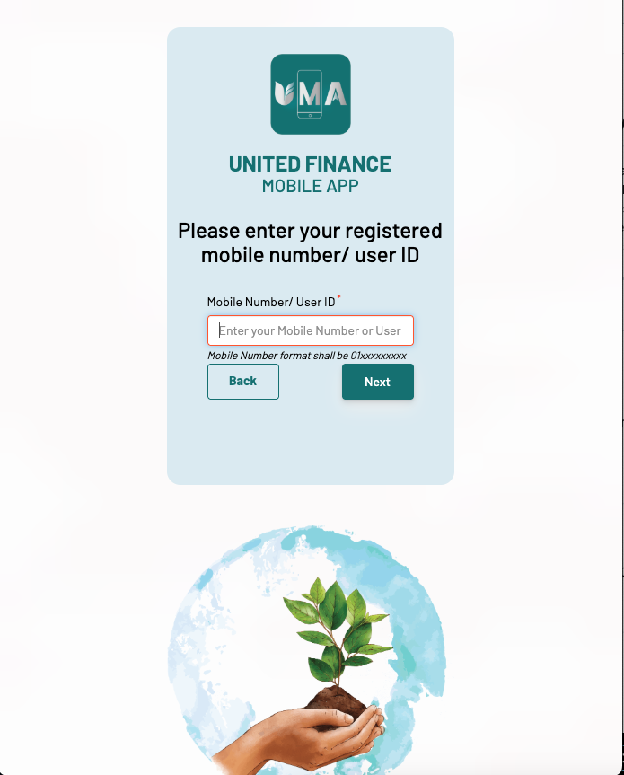
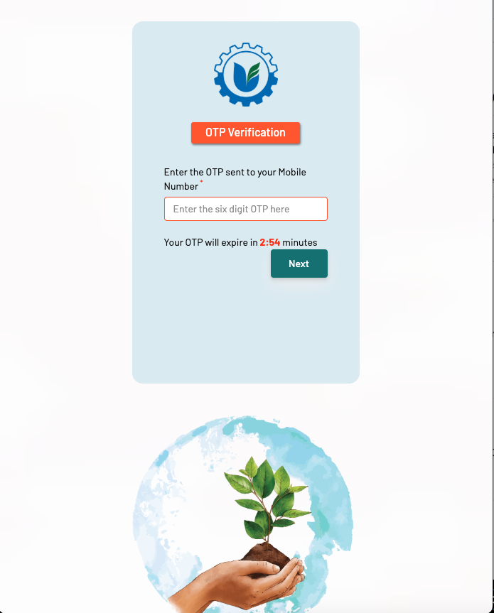
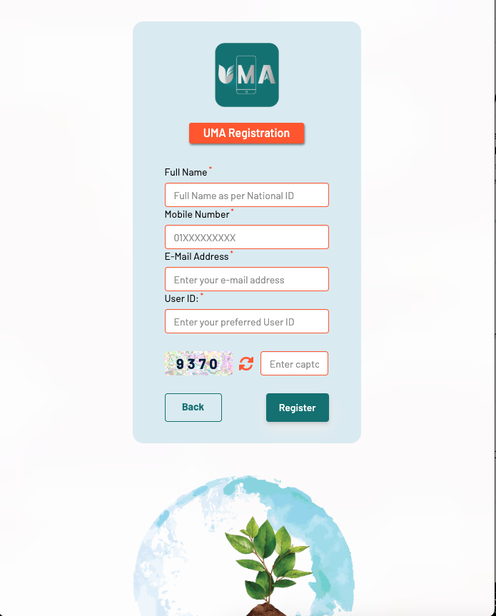

##  🏦 UMA – United Finance Mobile Banking Application

## Overview

A secure and scalable enterprise mobile banking platform designed for financial institutions. The system enables customers to access and manage full banking services through a unified digital channel, including deposits, loans, FDR, statements, and more.

The platform was built using ASP.NET MVC architecture with a custom business layer, integrated with SQL Server and Oracle databases, and connected to the Core Banking System (CBS) through secure RESTful APIs.

> Note:
> Due to organizational confidentiality policies, source code is not publicly shared.
> This repository focuses on architecture, engineering decisions, workflows, and implementation strategy.

---

## 🚀 Key Features
- Smart Notification Management System
- Secure OTP Generation & Validation
- User Registration & Authentication
- Password Recovery & Account Management
- Account Locking & Fraud Protection System
- Deposit Account Opening Workflow
- Fixed Deposit Receipt (FDR) Management
- Loan Account Opening & Processing
- Encashment & Transaction Services
- e-KYC & Biometric Verification Integration
- Real-time Data Validation Engine
- CBS (Core Banking System) Integration
- Secure API Gateway Communication
- Workflow Recovery Mechanism
- Admin Management Console
- Customer Statements & Transaction Reports
- Tax Certificate Generation
- Balance Inquiry & Account Services
- Customer Support & Service Desk Module
- Multi-service Digital Banking Operations

---

## 🛠 Technology Stack
- ASP.NET MVC (Web API + MVC Architecture)
- RESTful API Development & Integration
- Microsoft SQL Server (T-SQL, Query Optimization)
- Oracle Database (PL/SQL, Packages, Procedures, Triggers)
- Active Directory Integration (Authentication & Authorization)
- Secure Communication (HTTPS, TLS, Security Headers)
- JavaScript, jQuery, AJAX
- Regex-based validation & data parsing

---

## 👨‍💻 My Responsibilities (Lead Developer)
- Led backend architecture and security design for enterprise banking system
- Designed and implemented secure REST APIs for CBS integration
- Developed OTP generation, validation, and anti-bot protection mechanisms
- Implemented advanced security controls (XSS protection, input validation, request sanitization)
- Designed authentication and authorization flow with Active Directory integration
- Built cryptography-based secure communication and data protection layer
- Developed workflow recovery system for failed or interrupted transactions
- Implemented real-time validation logic across services
- Coordinated integration between ASP.NET services and Oracle/SQL Server databases
- Optimized database queries and improved system performance
- Defined API communication standards and integration architecture

# Screenshot

---

## ⭐ Key Engineering Highlights
- Enterprise-grade secure mobile banking architecture
- High-security API integration with CBS systems
- Multi-database integration (SQL Server + Oracle)
- Strong focus on fraud prevention and secure authentication
- Scalable service-oriented design with modular business logic

## 🔗 Live Application Link
https://ufifs.ufplc.com
